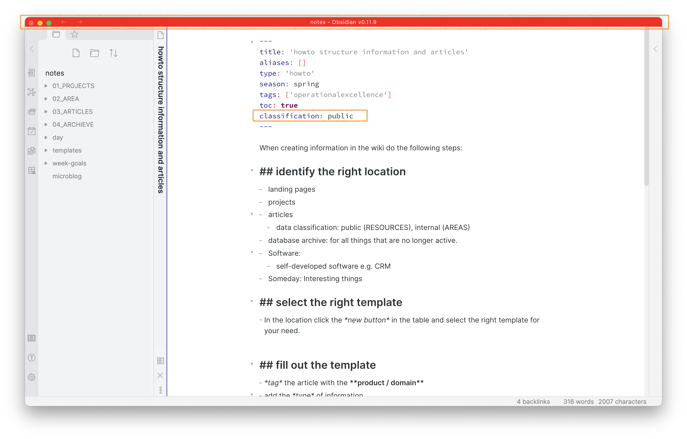

#  highlight public notes

This plugin for [Obsidian](https://obsidian.md/) highlights the titlebar of notes that you classify as public in the frontmatter. This prevents you from writing confidential data into notes you later publish e.g. through a script. 

## Usage

After enabling the plugin in the settings menu, all notes with a frontmatter with an attribute `classification: public` highlight the titlebar red.

In the settings of the plugin you can update the `attribute` the plugin  checks as well as the `value`. 

## Compatibility

`obsidian-calendar-plugin` currently requires Obsidian v0.9.11 or above to work properly.

## Installation

You can install the plugin via the Community Plugins tab within Obsidian. Just search for "highlight public notes".
